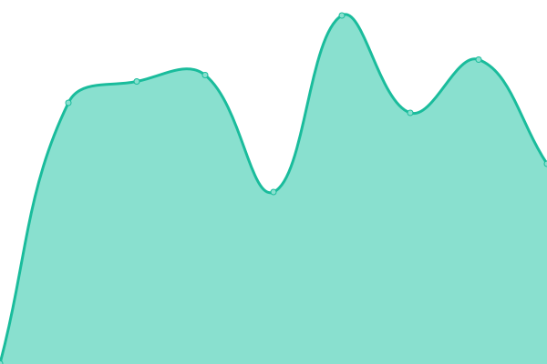

# [📈 Live Status](https://SFGrenade.github.io/upptime): <!--live status--> **🟩 All systems operational**

This repository contains the open-source uptime monitor and status page for [SFGrenade](https://sfgrena.de/), powered by [Upptime](https://github.com/upptime/upptime).

With [Upptime](https://upptime.js.org), you can get your own unlimited and free uptime monitor and status page, powered entirely by a GitHub repository. We use [Issues](https://github.com/SFGrenade/upptime/issues) as incident reports, [Actions](https://github.com/SFGrenade/upptime/actions) as uptime monitors, and [Pages](https://SFGrenade.github.io/upptime) for the status page.

<!--start: status pages-->
<!-- This summary is generated by Upptime (https://github.com/upptime/upptime) -->
<!-- Do not edit this manually, your changes will be overwritten -->
<!-- prettier-ignore -->
| URL | Status | History | Response Time | Uptime |
| --- | ------ | ------- | ------------- | ------ |
|  [hk-modding.org](https://hk-modding.org) | 🟩 Up | [hk-modding-org.yml](https://github.com/SFGrenade/upptime/commits/HEAD/history/hk-modding-org.yml) | 

 716ms
     
 | 

<a href="https://SFGrenade.github.io/upptime/history/hk-modding-org">100.00%</a>
    

|  [hk-modding.org gitea](https://git.hk-modding.org) | 🟩 Up | [hk-modding-org-gitea.yml](https://github.com/SFGrenade/upptime/commits/HEAD/history/hk-modding-org-gitea.yml) | 

 546ms
     
 | 

<a href="https://SFGrenade.github.io/upptime/history/hk-modding-org-gitea">100.00%</a>
    

|  [hk-modding.org skin service](https://skins.hk-modding.org) | 🟩 Up | [hk-modding-org-skin-service.yml](https://github.com/SFGrenade/upptime/commits/HEAD/history/hk-modding-org-skin-service.yml) | 

 596ms
     
 | 

<a href="https://SFGrenade.github.io/upptime/history/hk-modding-org-skin-service">100.00%</a>
    

|  [sfgrena.de](https://sfgrena.de) | 🟩 Up | [sfgrena-de.yml](https://github.com/SFGrenade/upptime/commits/HEAD/history/sfgrena-de.yml) | 

 441ms
     
 | 

<a href="https://SFGrenade.github.io/upptime/history/sfgrena-de">100.00%</a>
    

<!--end: status pages-->

[**Visit our status website →**](https://SFGrenade.github.io/upptime)

## 📄 License

- Powered by: [Upptime](https://github.com/upptime/upptime)
- Code: [MIT](./LICENSE) © [Anand Chowdhary](https://anandchowdhary.com), supported by [Pabio](https://pabio.com)
- Data in the `./history` directory: [Open Database License](https://opendatacommons.org/licenses/odbl/1-0/)
